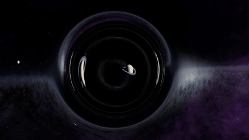
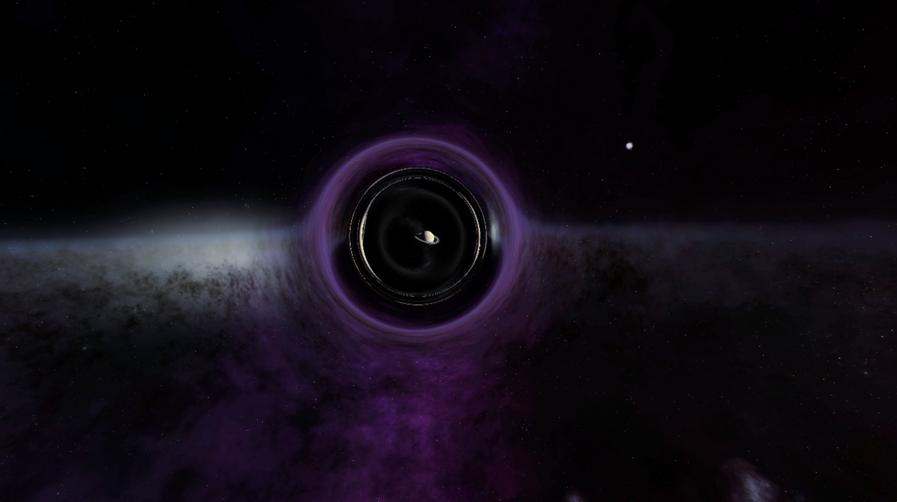
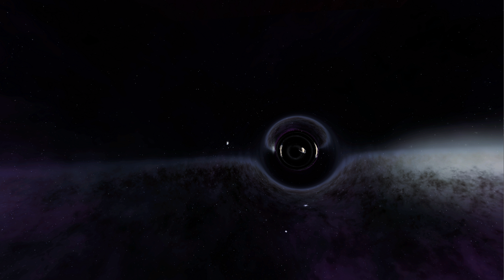
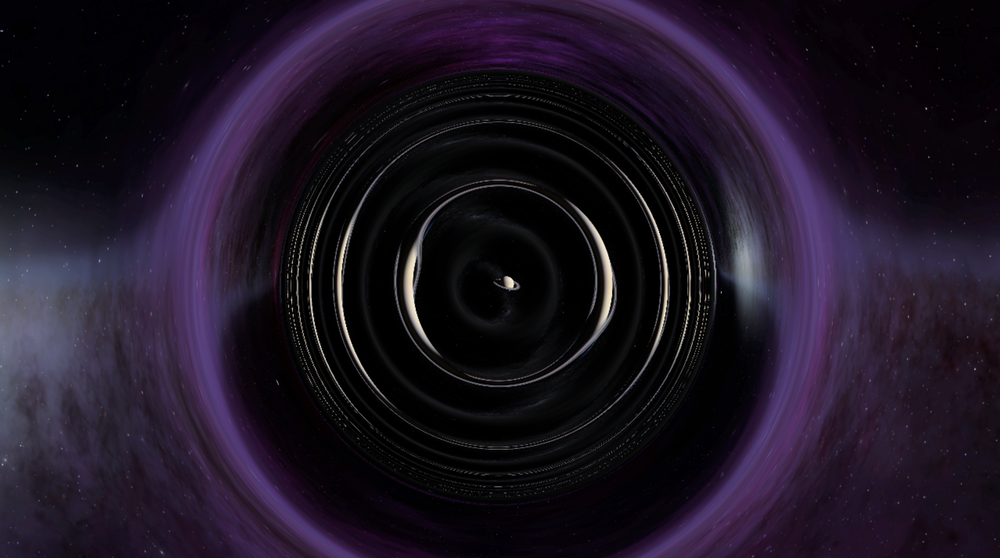
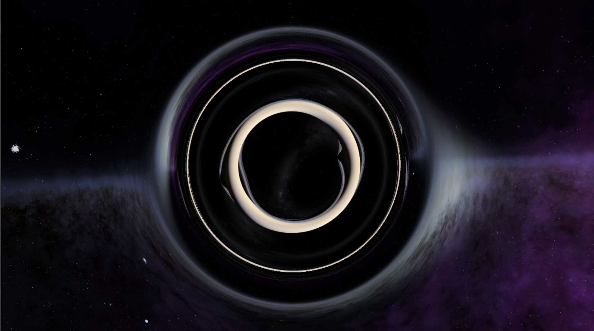
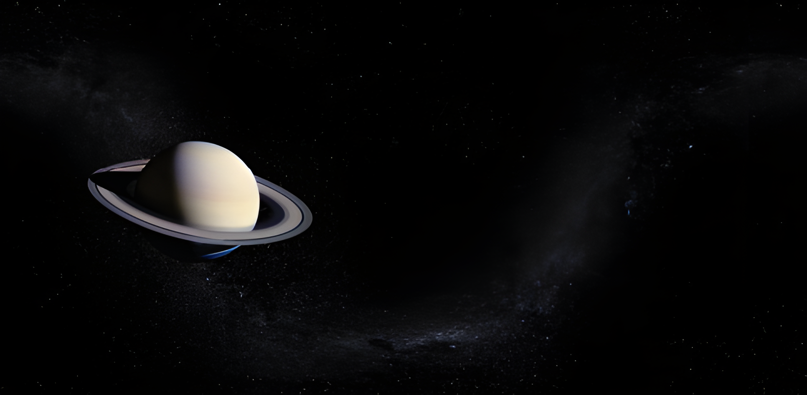

# Real-time 3D Wormhole Ray-Tracer

This is a real-time 3D wormhole simulation built with Python, Pygame, and ModernGL. It accurately simulates the visual distortion seen when looking at and traveling through a traversable wormhole (Morris-Thorne metric) by performing real-time ray-tracing in a GLSL fragment shader.

This project does not render a 3D model. Instead, it operates by **reverse ray-tracing** the path of light (the geodesic) through curved spacetime for every pixel on the screen.




*Figure 1: Viewing the wormhole head-on from a distance. The gravitational lensing (Einstein ring) is clearly visible, showing the distorted "other universe" in the center.*


*Figure 2: Viewing the wormhole from an off-axis angle. It acts as a "lens bubble" in spacetime, distorting the background nebula.*



*Figure 3: Entering the wormhole's "throat." The lensing is so intense that multiple images of the planet Saturn (from the other side) become visible, wrapped around the central opening.*
*See (https://arxiv.org/abs/1502.03809) FIG. 9 and FIG. 13.*


*Figure 4: A side-view while traversing the wormhole's throat. Light from both universes is extremely stretched and distorted, meeting at the "equator" and creating multiple, repeating ghost images.*


*The original figure of the world in front of wormhole.*
## Features

* **Real-time GPU Ray-Tracing:** Utilizes ModernGL to perform parallel ray-tracing on the GPU, enabling a high-framerate, interactive experience.
* **Physically Accurate:** The visual effects are based on the geodesic equations of general relativity, using a simplified analytic wormhole model from the paper [arXiv:1502.03809](https://arxiv.org/abs/1502.03809).
* **First-Person Free-Fly:** Full six-degrees-of-freedom (6-DOF) camera control using `WASDQE` keys and the mouse.
* **Connects Two Universes:** Each end of the wormhole connects to a different "universe," represented by two independent cubemaps.
* **Built-in GIF Recording:** Press the `Spacebar` to start or stop recording, automatically saving your journey as an animated GIF.

## Requirements

* Python 3.x
* `pygame`
* `moderngl`
* `numpy`
* `Pillow` (PIL)

## Installation & Setup

1.  **Clone or Download:**
    Get all the files from this repository.

2.  **Install Python Dependencies:**
    ```bash
    pip install pygame moderngl numpy pillow
    ```

3.  **Prepare Skyboxes (Crucial Step):**
    This program depends on two skybox texture packs. You **must** create two folders in the same directory as the Python script: `skybox1` and `skybox2`.

    * **`skybox1` Folder** (representing Universe A) must contain the following 6 images:
        * `right.png`
        * `left.png`
        * `top.png`
        * `bottom.png`
        * `front.png`
        * `back.png`

    * **`skybox2` Folder** (representing Universe B) must contain the following 6 images:
        * `px.png`
        * `nx.png`
        * `py.png`
        * `ny.png`
        * `pz.png`
        * `nz.png`

    (Note: The two skyboxes use different naming conventions. The `load_cubemap` function in the code is already set up to handle this.)

    You can find usable skybox resources (like the format for `skybox2`) here: [Keijiro's Cubemap Repository](https://github.com/keijiro/CubeMap-Unity/tree/master/Assets/CubeMap)
    Or you can treat your own backgrounds in [Panorama to Cubemap](https://jaxry.github.io/panorama-to-cubemap/).

## Usage

Ensure all dependencies are installed and the skybox folders are prepared as described above. Then, run the Python script (assuming you've named it `wormhole_sim.py`):

```bash
python wormhole_sim.py
```

## Controls

* **Mouse:** Look around (controls camera orientation)
* **`W` / `S`:** Move forward / backward
* **`Spacebar`:** **Start / Stop GIF Recording**. After stopping, a timestamped `.gif` file will be saved in the script's directory.
* **`ESC`:** Exit the simulation

---

## In-Depth Theoretical Analysis

The physical core of this simulation lies in the GLSL fragment shader (`get_fragment_shader`), which acts as a real-time **geodesic integrator**.

### 1. Core Concept: Reverse Ray-Tracing

In General Relativity, photons (light) travel along "straight lines" through curved spacetime, known as **geodesics**.

To simulate what we see, the program starts from each pixel on the "camera" and traces a light ray **backwards in time**, calculating how its path is bent by the wormhole's gravitational field. This tracing continues until the ray "escapes" to a distant, flat region of spacetime and "hits" one of the two universe's skyboxes.

### 2. The Spacetime Model: A Simplified Morris-Thorne Metric

The geometry model in this code is not derived from complex numerical simulations but is based on an **analytic model** proposed in **Section IV, "A SIMPLIFIED WORMHOLE,"** of the reference paper ([arXiv:1502.03809](https://arxiv.org/abs/1502.03809)). This model is mathematically simpler while perfectly recreating the key visual features.

#### Key Equation 1: The Shape Function $r(l)$

The core of this model is the **"shape function" $r(l)$**, which defines the wormhole's geometry:
* $l$ is the **"proper distance"** along the wormhole's axis. $l=0$ is the center of the throat, $l>0$ is Universe A, and $l<0$ is Universe B.
* $r$ is the **"radial coordinate"** of the wormhole at a given $l$.

**Equation (17)** from the paper gives this shape function:
$$r(l) = \rho + M \left( x \arctan x - \frac{1}{2} \ln(1+x^2) \right)$$
where
$$x = \max\left(0, \frac{2(|l|-a)}{\pi M}\right)$$

This **corresponds exactly** to the GLSL `LtoR` (Length to Radius) function:

```glsl
float LtoR(float l){
    float x = max(0., 2. * (abs(l) - a) / (PI * M_wh));
    return rho + M_wh * (x * atan(x) - 0.5 * log(1. + x * x));
}
```
* `rho` (`WORMHOLE_RHO`) is the throat radius.
* `a` (`WORMHOLE_A`) is the length of the "transition region" between the throat and flat spacetime.
* `M_wh` (`WORMHOLE_M`) is the mass parameter of the wormhole.

#### Key Equation 2: The Shape Function's Derivative $\frac{dr}{dl}$

The motion of the photon (i.e., the effect of gravity on it) depends on the gradient of the spacetime curvature, which requires the derivative of the shape function, $\frac{dr}{dl}$. Differentiating the $r(l)$ equation yields:

$$\frac{dr}{dl} = \frac{2}{\pi} \arctan(x) \cdot \text{sign}(l)$$

This **once again perfectly matches** the GLSL `LtoDR` (Length to Derivative-of-Radius) function:

```glsl
float LtoDR(float l){
    float x = max(0., 2. * (abs(l) - a) / (PI * M_wh));
    return 2. * atan(x) * sign(l) / PI;
}
```

### 3. Numerical Integration: Solving the Geodesic

The `for` loop in the shader is an **Euler numerical integrator**. It solves the photon's equations of motion over `MAX_STEPS` with a step size of `DT`.

* `H` is a conserved quantity representing the photon's **angular momentum** (or impact parameter).
* `dl` is the velocity component of the ray along the $l$ axis.

The three update steps in the loop are a direct implementation of the physics:

1.  `l += dl * DT;`
    * **Physics:** Updates the ray's **position** $l$ along the axis.

2.  `phi += H / (r * r) * DT;`
    * **Physics:** Updates the ray's **deflection angle** $\phi$. This comes directly from the conservation of angular momentum, $\frac{d\phi}{d\tau} = \frac{H}{r^2}$.

3.  `dl += H * H * dr / (r * r * r) * DT;`
    * **Physics:** **This is gravity!** This line updates the ray's **velocity** $v_l$ along the $l$ axis.
    * It comes from the geodesic equation $\frac{d^2l}{d\tau^2} = \frac{H^2}{r^3} \frac{dr}{dl}$.
    * `dr` is the `LtoDR(l)` we calculated (i.e., $\frac{dr}{dl}$).
    * This line means: **The change in the ray's velocity $dl$ (its acceleration) is proportional to the gradient of spacetime curvature $\frac{dr}{dl}$ and the square of its angular momentum $H$.**

### 4. Visual Distortion: Gravitational Lensing

When you use the `A/D` (strafe left/right) or `Q/E` (strafe up/down) keys, you are changing the camera's **transverse position** (its $x$ and $y$ coordinates) relative to the wormhole's central axis (the Z-axis).

* This does not change the wormhole's physical properties, but it *does* change the light ray's **"impact parameter"** (related to `H`).
* As the camera moves off-axis, light rays from the other side must take a more "grazing" path to reach your eye.
* This means the light rays "skim" closer to the strong gravitational field of the wormhole's throat ($l$ near $0$).
* This closer pass results in more extreme light bending, which manifests visually as the **drastic stretching, warping, and asymmetrical gravitational lensing** that you observe.

## References

The ray-tracing equations and physical model used in this simulation are primarily based on the following paper:

* **Title:** Visualizing Interstellar's Wormhole
* **Authors:** Oliver James, Eugénie von Tunzelmann, Paul Franklin, Kip S. Thorne
* **arXiv Link:** [https://arxiv.org/abs/1502.03809](https://arxiv.org/abs/1502.03809)

The project was also heavily inspired by the following resources:

* **Inspirational Video:** "Coding Adventure: Wormhole" by ScienceClic (Alessandro Roussel).
    * **YouTube Link:** [https://www.youtube.com/watch?v=ABFGKdKKKyg](https://www.youtube.com/watch?v=ABFGKdKKKyg)
* **Original Shader Concept:** "Wormhole" by ScienceClic (Alessandro Roussel) on Shadertoy.
    * **Shadertoy Link:** [https://www.shadertoy.com/view/lcdGWB](https://www.shadertoy.com/view/lcdGWB)

## License


This project is licensed under the [MIT License](https://opensource.org/licenses/MIT).


